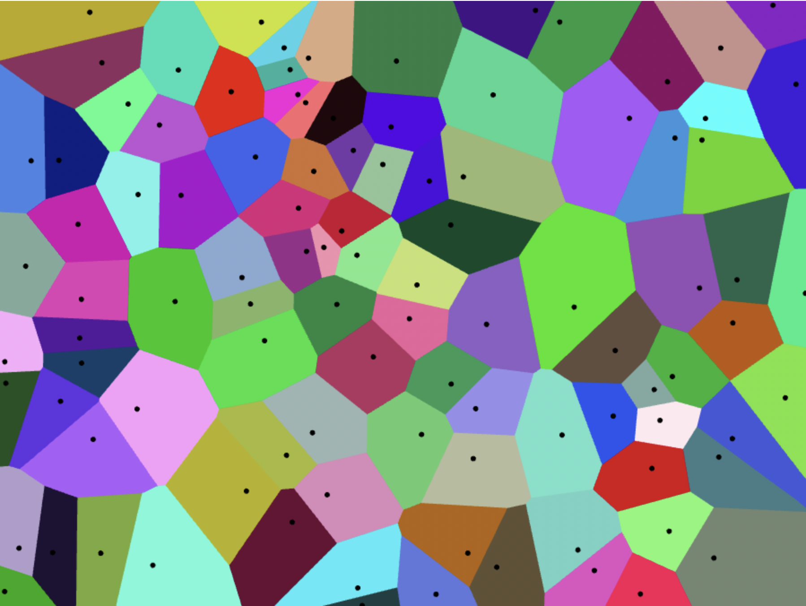

|  |
|:--:|
| *1000 Voronoi cells in a concave arc segment* |

# Lloyd's algorithm, but in the GPU
This is [Lloyd's algorithm](https://en.wikipedia.org/wiki/Lloyd%27s_algorithm) implemented with [WebGPU](https://developer.mozilla.org/en-US/docs/Web/API/WebGPU_API). The implementation is similar to the one used in the [Swingline Voronoi Stippling Library](https://www.mattkeeter.com/projects/swingline/).

# What is Lloyd's algorithm?
I'm glad you asked! Lloyd's algorithm is a method for finding evenly spaced points within a Euclidean subplane by iteratively constructing [Voroni diagrams](https://en.wikipedia.org/wiki/Voronoi_diagram) which partition a subset of the plane into regions called "cells" or "Voronoi cells."  Each cell comprises the coordinates closest to the point inside it. Here's an example of a Voronoi diagram of 100 random points on a plane (*points on a plain*, is that a joke?). The cells are color-coded for clarity:
|  |
|:--:|
| *Vornoi diagram of 100 random points on a plane* |

For an example of a practical application, imagine that these points represent items on a screen and you want to highlight the item closest to the user’s mouse. In this scenario, you can render a hidden Voronoi diagram and highlight a point when the mouse is over that point's respective cell.  If you want to know more about Voronoi Diagrams, I suggest reading Francesco S. Bellelli's great [The fascinating world of Voronoi diagrams](https://fbellelli.com/posts/2021-07-08-the-fascinating-world-of-voronoi-diagrams/).

Lloyd's algorithm operates through a series of steps aimed at making increasingly more uniform Voronoi diagrams. The result is a partition of N cells that are nearly identical. The process follows these steps:

1. Create a Voronoi diagram from the given points
1. Calculate the centroid of each cell
1. Move each point to the centroid of its cell
1. Repeat these steps

As the distance between a point and the centroid of its cell gradually diminishes, the diagram converges to a mesh of relatively uniform cells like the one pictured at the top of this article.

# Dependencies
The project is built with, [Webpack](https://webpack.js.org/) and [Yarn](https://yarnpkg.com/). You will also need a [browser that supports WebGpu](https://caniuse.com/webgpu)

# Usage
To run this project locally use `yarn develop` and then visit `http://localhost:4000/`.

